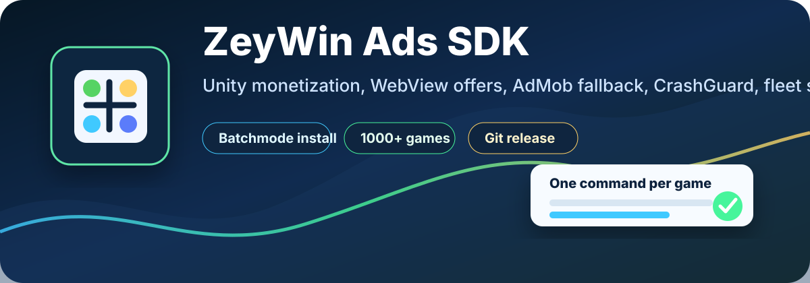
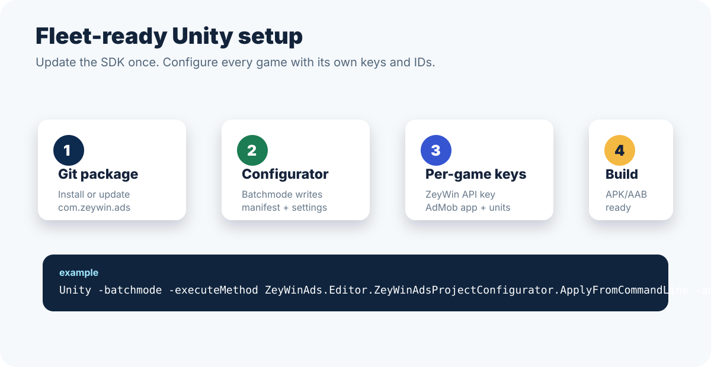

<p align="center">
  
</p>

# ZeyWin Ads SDK for Unity


Drop-in mobile advertising SDK for Unity games. The goal is that every game repo stays clean: install this one package, enter the ZeyWin key and ad IDs, and the SDK handles the advertising stack, WebView offer flow, loading UI, AdMob fallback, CrashGuard, ATT/UMP, and build-time native configuration.

<p align="center">
  
</p>

## Installation

### Via Package Manager (Git URL)

1. Open **Window > Package Manager**
2. Click **+** button → **Add package from git URL**
3. Enter: `https://github.com/zey-win/ZeyWinAdsSDK-Unity.git`
4. Click **Add**

On first import the SDK will automatically add and configure:

- Google Mobile Ads via the OpenUPM scoped registry, unless the project already has a legacy `Assets/GoogleMobileAds` plugin
- Google External Dependency Manager for native dependency resolution
- Unity UI / TextMesh Pro project dependencies
- TextMesh Pro Essential Resources and Examples & Extras in `Assets/TextMesh Pro`
- TextMesh Pro shader/material build setup, including TMP shaders in Always Included Shaders
- CrashGuard SDK as a sibling package
- SDK-owned WebView/loading/native configuration helpers, including SafeArea-aware offer WebViews
- SDK-owned Android WebView offers with a topmost Java loading screen, 3-second fade-out, runtime camera prompt bridge, and Google/Apple/Telegram login navigation support
- Android autorotation, HTTP/browser queries, deeplink intent-filter, WebView camera/microphone permissions, and native notification permission prompt
- AdMob banner suppression while ZeyWin banners, popups, or WebView offers are active

Unity will reload and resolve the packages for you.

### Manual Installation

1. Download the package.
2. Copy this package to `Packages/com.zeywin.ads/`.
3. Open **ZeyWinAds > Install AdMob** and **ZeyWinAds > Install CrashGuard** if you are not using Git URL installation.

## Setup

1. Open **ZeyWinAds > Settings** from the Unity menu. This creates `Assets/Resources/ZeyWinAdsSettings.asset`.
2. Fill in your ZeyWin **API Key**. With **Auto Initialize On Startup** enabled, the SDK starts before the first scene loads.
3. Fill in your AdMob **App ID** and **Ad Unit IDs** for Android and iOS. They are written into `AndroidManifest.xml` and `Info.plist` automatically at build time.
4. Set **Enable AdMob** to `false` if you want to disable the fallback entirely.

### Batchmode fleet configuration

For large game fleets, run the configurator once per project after installing or updating this package. The command is idempotent and can be reused whenever a game receives new keys:

```bash
/path/to/Unity \
  -batchmode -quit \
  -projectPath /path/to/game \
  -executeMethod ZeyWinAds.Editor.ZeyWinAdsProjectConfigurator.ApplyFromCommandLine \
  -productName "Plinko Real Money" \
  -companyName "zeywin" \
  -androidPackageId "com.playsocialgames.plinkofun" \
  -androidVersionName "1.2.6" \
  -androidVersionCode "10" \
  -zeywinApiKey "zw_xxx" \
  -adMobAppId "ca-app-pub-xxx~yyy" \
  -bannerAdUnitId "ca-app-pub-xxx/banner" \
  -interstitialAdUnitId "ca-app-pub-xxx/interstitial" \
  -rewardedAdUnitId "ca-app-pub-xxx/rewarded"
```

The configurator updates `PlayerSettings`, creates or updates `Assets/Resources/ZeyWinAdsSettings.asset`, patches `Assets/Plugins/Android/AndroidManifest.xml` with the app label and AdMob metadata, and mirrors the Android AdMob App ID into `GoogleMobileAdsSettings.asset` when that asset exists.
For bulk installs, the only required monetization values are `zeywinApiKey`, `adMobAppId`, `bannerAdUnitId`, `interstitialAdUnitId`, and `rewardedAdUnitId`; older `admobAndroid...` argument names remain supported for existing automation.
For unattended fleet runs, pass those same values through `ZEYWIN_API_KEY`, `ADMOB_APP_ID`, `ADMOB_BANNER_AD_UNIT_ID`, `ADMOB_INTERSTITIAL_AD_UNIT_ID`, and `ADMOB_REWARDED_AD_UNIT_ID` so they do not appear in Unity command-line logs.

### Fleet runner

The repository includes `tools/zeywin-fleet-configure.sh`, a TSV-driven runner for many games. It discovers Unity projects by `ProjectSettings/ProjectVersion.txt`, snapshots non-git projects before mutation, pins `com.zeywin.ads` and `com.crashguard.sdk`, then invokes the configurator.

```bash
tools/zeywin-fleet-configure.sh \
  --root /Volumes/Work/games \
  --config /path/to/fleet-config.tsv \
  --sdk-ref v3.8.1 \
  --unity-path /Applications/Unity/Hub/Editor/6000.0.71f1/Unity.app/Contents/MacOS/Unity \
  --require-unity6
```

Each TSV row needs `projectPath`, `zeywinApiKey`, `adMobAppId`, `bannerAdUnitId`, `interstitialAdUnitId`, and `rewardedAdUnitId`. Optional columns can set `productName`, `companyName`, `androidPackageId`, `androidVersionName`, `androidVersionCode`, and `unityPath`.
Use `--unity-path` with `--require-unity6` when older projects must be upgraded and configured through Unity 6 instead of the editor recorded in `ProjectVersion.txt`.

Fleet APK/AAB checks can use the package builder after configuration:

```bash
/Applications/Unity/Hub/Editor/6000.0.71f1/Unity.app/Contents/MacOS/Unity \
  -batchmode -quit \
  -projectPath /Volumes/Work/games/lucky_wheel \
  -executeMethod ZeyWinAds.Editor.ZeyWinAdsAndroidBuilder.BuildApkFromCommandLine \
  -outputPath /Volumes/Work/builds/lucky_wheel.apk \
  -androidVersionName 1 \
  -androidVersionCode 1 \
  -androidArchitectures ARM64
```

For signed builds, pass `ANDROID_KEYSTORE_PATH`, `ANDROID_KEYSTORE_PASS`, `ANDROID_KEYALIAS_NAME`, and `ANDROID_KEYALIAS_PASS` through the environment.
The builder disables Android optimized frame pacing by default for Unity 6 fleet APK checks; set `ANDROID_OPTIMIZED_FRAME_PACING=true` if a release build explicitly needs Swappy enabled.

For iOS builds, the SDK also writes `NSUserTrackingUsageDescription` and Google AdMob `SKAdNetworkItems` into `Info.plist` from the settings asset. If **Request App Tracking Transparency** is enabled, the SDK requests ATT authorization on iOS 14+ during startup.
When **Enable UMP Consent** is enabled, AdMob fallback waits for Google UMP consent update and displays any required consent form before requesting ads.

If your project does not yet have `Assets/Plugins/Android/AndroidManifest.xml`, create one (or run **ZeyWinAds > Update AndroidManifest Queries** which generates it).

## Startup behaviour

When `autoInitializeOnStartup` is enabled, the SDK initializes before the first scene and starts the monetization decision flow immediately.

- If the user passes anti-moderation, geo, SIM, and server checks, the startup offer is preloaded and shown in the SDK WebView as soon as it is ready.
- While a WebView is active or about to appear, the SDK shows its own fullscreen blue loading overlay. The money pack crosses the lower progress bar once over 8 seconds, fills the yellow trail in uneven steps, and the `Loading XX%` label stays below the bar.
- If the user fails the local suspicious-app check, the SDK shows the ZeyWin promo flow that opens the target app in Google Play.
- If the device is blocked, the country has no offer, SIM/geo checks fail, or the startup offer cannot be loaded, the SDK falls back to Google AdMob interstitial.
- AdMob preload starts in parallel with ZeyWin startup checks so fallback can appear quickly.

## Quick Start

```csharp
using ZeyWinAds;
using UnityEngine;

public class AdExample : MonoBehaviour
{
    void Start()
    {
        // Optional if Auto Initialize On Startup is enabled in ZeyWinAdsSettings.
        ZeyWinAds.Initialize("YOUR_API_KEY");
    }

    public void ShowInterstitial()
    {
        if (ZeyWinAds.IsInterstitialReady())
            ZeyWinAds.ShowInterstitial(onClose: () => Debug.Log("Interstitial closed"));
    }

    public void ShowRewarded()
    {
        if (ZeyWinAds.IsRewardedReady())
            ZeyWinAds.ShowRewarded(
                onReward: amount => Debug.Log($"Earned: {amount}"),
                onClose:  () => Debug.Log("Rewarded closed"));
    }

    public void ShowBanner() => ZeyWinAds.ShowBanner(BannerPosition.Bottom);
    public void HideBanner() => ZeyWinAds.HideBanner();

    public void ShowNativeBanner()
    {
        if (ZeyWinAds.IsNativeReady())
            ZeyWinAds.ShowNative(BannerPosition.Bottom);
    }

    public void HideNativeBanner() => ZeyWinAds.HideNative();
}
```

## Automated Native Banner

`ShowNative(BannerPosition.Top)` and `ShowNative(BannerPosition.Bottom)` render an SDK-owned native banner for connected games. The banner is a white card, 80% of the screen width, with a minimum height of 150 px and adaptive height for longer headlines, body text, and CTA labels.

The card slides in from the requested edge, respects the device safe area, and only the white card captures taps. Empty space around it remains transparent so game UI outside the banner stays interactive.

On tap, the SDK calls the same click flow used by other ZeyWin ads. If the ad response includes `store_url` with a Google Play URL, the SDK registers the referral click and opens Google Play for the target app. If `store_url` is missing, it falls back to `click_url`.

## Mediation behaviour

- ZeyWin and AdMob preload **in parallel** at SDK init.
- On every `Show*` call: ZeyWin's ad is shown first if available; otherwise AdMob's. If neither is ready, the close callback is invoked immediately.
- AdMob is **not** subject to ZeyWin's anti-fraud / geo / SIM gating — if the device is blocked from ZeyWin ads, AdMob still works.
- `IsInterstitialReady()` / `IsRewardedReady()` / `IsBannerReady()` return true if **either** network has an ad ready.
- `HideBanner()` hides whichever network is currently showing the banner.

## Production notes

- Runtime logs go through `ZeyWinAds.Core.Logger`; direct Unity `Debug.Log*` calls are avoided in runtime code.
- Offer URLs, media URLs, API keys, click IDs, and raw install referrers are not printed by the SDK runtime logger.
- Android install-referrer support uses the bundled `installreferrer-2.2.aar`.
- Android package visibility queries for referral/suspicious-app checks are generated into `AndroidManifest.xml`.
- iOS builds can add ATT text, request ATT authorization, and write Google AdMob SKAdNetwork IDs automatically.
- Shared SDK visual assets, including the money loading marker, are shipped from package `Resources` so each game does not need to duplicate them.

## Release verification

- Unity Editor compile: verified.
- Android target compile: verified.
- Android APK smoke build: verified.
- iOS target compile: verified.
- iOS Xcode export smoke build: verified.

## Ad Types

- **InterstitialAd** — full-screen ads (ZeyWin → AdMob fallback)
- **RewardedAd** — full-screen ads with rewards (ZeyWin → AdMob fallback)
- **BannerAd** — banner ads, top/bottom (ZeyWin → AdMob fallback)
- **NativeAd** — automated native banner, top/bottom, white 80% width card, Google Play redirect via `store_url`
- **PopupAd** — ZeyWin-only

## Requirements

- Unity 2020.3 or later
- iOS 11+ / Android API 21+
- Google Mobile Ads Unity package (auto-installed)
